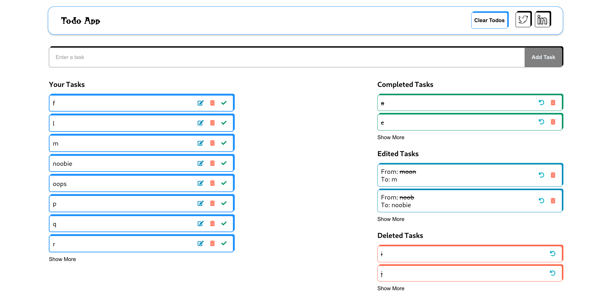

# Todo App

A simple and intuitive Todo app built using HTML, CSS, and JavaScript.

## Features

- Add, edit, and delete tasks effortlessly.
- Intuitive icons for easy task management.
- Persistence ensured with local storage.

## Usage

1. Clone the repository:
git clone https://github.com/P-Nth/TODO.git

2. Open `index.html` in your web browser.

3. Start managing your tasks!

4. OR

5. Use it on the web: https://p-nth.github.io/TODO/
## Preview

## Contributing

Contributions are welcome! If you have any suggestions or improvements, please feel free to submit a pull request.

## License

This project is licensed under the [Apache License](LICENSE).

## Feedback

If you have any feedback or questions, feel free to reach out on Twitter [@my-twitter-handle](https://twitter.com/_the_nth).

Enjoy your organized and productive day with the Todo App! 🚀✨
